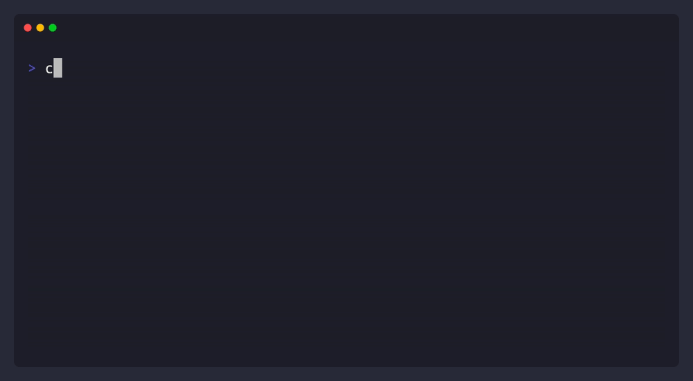

<div align="center">

<pre>
█▀▀ █ █ █   █▀█ █▀▀
█▄▄ █▀█ █▄▄ █▄█ █▄█
</pre>

**YAML-First Changelog Management — CLI + Go Library**

[](https://github.com/ariel-frischer/chlog/actions/workflows/ci.yml)
[](https://github.com/ariel-frischer/chlog/releases/latest)
[](https://goreportcard.com/report/github.com/ariel-frischer/chlog)
[](https://opensource.org/licenses/MIT)

AI-agent ready. One source of truth. No drift. Write curated entries, generate changelogs and release notes.

</div>

<p align="center">
  
</p>

## Install

```bash
curl -fsSL https://raw.githubusercontent.com/ariel-frischer/chlog/main/install.sh | sh
```

## Features

- 📝 **YAML source of truth** — structured, diffable, machine-readable changelog
- ✅ **Schema validation** — catch malformed entries before they reach CI
- 📦 **One-command releases** — stamp version, generate Markdown, extract release notes
- 🔀 **Public + internal entries** — separate customer-facing notes from implementation details
- 🤖 **AI-agent ready** — ships an [Agent Skill](#ai-agent-skill) so coding agents know the schema and commands
- 🔧 **Scaffold from commits** — auto-generate entries from conventional commits as a starting point
- 🚀 **CI integration** — `chlog check` as a pipeline gate, `chlog extract` for GitHub Releases

## Quickstart

```bash
chlog init                          # Create CHANGELOG.yaml + .chlog.yaml
chlog add added "New feature"       # Add entry to unreleased
chlog add fixed "Bug fix"           # Add a fix
chlog sync                          # Generate CHANGELOG.md (public only)
chlog release 1.0.0                 # Promote unreleased → 1.0.0
```

## Commands

```bash
# Setup
chlog init                          # Create CHANGELOG.yaml + .chlog.yaml (auto-detects repo URL)
chlog init --project myapp          # Skip project name prompt

# Add & remove entries
chlog add added "New feature"       # Add entry to unreleased
chlog add fixed -v 1.2.0 "Fix"     # Add to specific version
chlog add changed -i "Refactor"    # Add as internal entry
chlog remove added "New feature"    # Remove exact entry
chlog remove added -m "feat"       # Remove by substring match

# Generate & validate
chlog sync                          # Generate CHANGELOG.md (public only)
chlog sync --split                  # Generate both public + internal changelogs
chlog check                         # CI gate — verify markdown matches YAML
chlog check --split                 # Verify both public + internal changelogs
chlog validate                      # Validate YAML schema

# View & extract
chlog show                          # View changelog in terminal
chlog show 0.3.0                    # View specific version
chlog show --last 5                 # View last 5 entries
chlog extract 0.3.0                 # Output release notes (for gh release)

# Scaffold from commits
chlog scaffold                      # Auto-scaffold from conventional commits
chlog scaffold --write              # Scaffold and merge into CHANGELOG.yaml
chlog scaffold --version 1.2.0      # Scaffold with explicit version string

# Release
chlog release 1.0.0                 # Promote unreleased → 1.0.0 with today's date
chlog release 1.0.0 --date 2026-03-01  # Promote with explicit date
```

<details>
<summary>Advanced commands demo</summary>

<p align="center">
  
</p>

</details>

## Why?

Commit-based changelog tools (git-cliff, semantic-release) dump raw git logs. That works when humans write every commit, but AI agents generate dozens of implementation commits per feature. You don't want that noise in your release notes — you want **curated entries that tell users what actually changed**.

- **Structured YAML** — machine-readable, diffable, easy for agents and scripts to edit
- **Schema validation** — `chlog check` catches malformed entries before they hit CI
- **One-command releases** — `chlog release v1.2.0` stamps the version, generates Markdown, done
- **CI-friendly** — validate in pipelines, extract release notes for GitHub Releases or Slack, no manual formatting
- **Curated over generated** — you control what users see, not your git log

`chlog` separates product communication from implementation history:

```
# git log (what tools like git-cliff give you)
a4f2c1 fix: adjust retry backoff timing
b92e0a refactor: extract http client helper
c7d31b fix: handle nil pointer in auth middleware
d1a8ef feat: add timeout flag
e53f90 chore: update deps

# CHANGELOG.yaml (what you write, or your agent summarizes)
added:
  - "Configurable request timeout via --timeout flag"
fixed:
  - "Auth no longer crashes on expired tokens"
```

### Using AI agents with chlog

Two workflows — use one or both:

**Per-change** — agent adds a changelog entry as part of each feature or fix. Install the [SKILL.md](#ai-agent-skill) so your agent knows the YAML schema and commands, then include "update CHANGELOG.yaml" in your task prompt. The agent can use `chlog add added "Description"` or edit the YAML directly — either works.

**At release time** — agent reviews all commits since the last release, groups them into user-facing summaries, and writes the YAML. `chlog scaffold --write` gives it a starting point from conventional commits, then the agent curates.

See [`prompts/`](prompts/) for copy-paste prompts you can use with any AI agent.

## Schema

```yaml
project: my-tool
versions:
  unreleased:
    added:
      - "New feature description"
    internal:
      changed:
        - "Refactored auth middleware"

  0.1.0:
    date: "2026-02-24"
    added:
      - "Initial release"
    fixed:
      - "Bug fix description"
```

Categories are arbitrary YAML keys on each version. By default the six [Keep a Changelog](https://keepachangelog.com/) categories are enforced: `added`, `changed`, `deprecated`, `removed`, `fixed`, `security`. Custom categories can be allowed via [config](#config).

### Internal entries

chlog supports a two-tier model: **public** entries (customer-facing release notes) and **internal** entries (implementation details like refactors, perf improvements, dependency updates). Public entries live directly on the version, internal entries under `internal` — same categories, separate audiences.

By default, internal entries are excluded from output. Include them with `--internal`:

```bash
chlog sync --internal       # Render internal entries in CHANGELOG.md
chlog show --internal       # Show internal entries in terminal
chlog extract 1.0 --internal
chlog check --internal      # Compare with internal entries included
```

To always include internal entries, set `include_internal: true` in `.chlog.yaml` (see [Config](#config)). The `--internal` flag and config option are OR'd together — config provides the team default, the flag always adds them.

`chlog scaffold` auto-classifies `refactor`/`perf` conventional commits as internal, so `scaffold --write` populates both tiers automatically.

## Config

Optional `.chlog.yaml` in your project root. Created automatically by `chlog init` with auto-detected values:

```yaml
repo_url: https://github.com/myorg/myproject
include_internal: true
categories: [added, changed, fixed, performance]  # custom allowlist (optional)
strict_categories: false                           # false = accept any category (optional)
```

| Field | Default | Description |
|-------|---------|-------------|
| `repo_url` | auto-detect from `git remote origin` | Used for version comparison links in `CHANGELOG.md` |
| `include_internal` | `false` | Include internal entries in all commands (`sync`, `show`, `extract`, `check`) |
| `categories` | Keep a Changelog 6 | Custom allowlist of category names for validation |
| `strict_categories` | `true` | Set to `false` to accept any category without validation |

## CI

GitHub Actions example:

```yaml
name: Changelog Check
on:
  pull_request:
    paths: ["CHANGELOG.yaml", "CHANGELOG.md"]
jobs:
  check:
    runs-on: ubuntu-latest
    steps:
      - uses: actions/checkout@v4
      - uses: actions/setup-go@v5
        with:
          go-version-file: go.mod
      - run: go install github.com/ariel-frischer/chlog@latest
      - run: chlog validate
      - run: chlog check
```

Exit codes: `0` in sync, `1` out of sync, `2` validation error.

## Other Install Options

**Go install**:

```bash
go install github.com/ariel-frischer/chlog@latest
```

**From source**:

```bash
git clone https://github.com/ariel-frischer/chlog.git
cd chlog
make build    # Binary at bin/chlog
```

## Library

`chlog` is both a CLI tool and an importable Go library. Use `pkg/changelog` directly in your own Go projects for programmatic changelog management — no subprocess needed.

```go
import "github.com/ariel-frischer/chlog/pkg/changelog"

// Load and query
c, err := changelog.Load("CHANGELOG.yaml")
latest := c.GetLatestRelease()
entries := c.GetLastN(5)

// Access categories
added := latest.Public.Get("added")       // []string
latest.Public.Append("fixed", "Bug fix")  // add entry
latest.Public.Remove("fixed", "Bug fix", false)  // remove entry (exact match)
latest.Public.Remove("fixed", "bug", true)       // remove entry (substring match)

// Programmatic release
c.Release("2.0.0", "2024-06-01")
changelog.Save(c, "CHANGELOG.yaml")

// Render to Markdown
md, _ := changelog.RenderMarkdownString(c)

// Parse from any io.Reader
c, err = changelog.LoadFromReader(reader)
```

See the [package documentation](https://pkg.go.dev/github.com/ariel-frischer/chlog/pkg/changelog) for the full API.

## Shell Completion

chlog includes built-in shell completions for all commands and flags.

**Bash:**

```bash
# Current session
source <(chlog completion bash)

# Persistent (Linux)
chlog completion bash > /etc/bash_completion.d/chlog

# Persistent (macOS)
chlog completion bash > $(brew --prefix)/etc/bash_completion.d/chlog
```

**Zsh:**

```bash
# Current session
source <(chlog completion zsh)

# Persistent (Linux)
chlog completion zsh > "${fpath[1]}/_chlog"

# Persistent (macOS)
chlog completion zsh > $(brew --prefix)/share/zsh/site-functions/_chlog
```

**Fish:**

```bash
chlog completion fish > ~/.config/fish/completions/chlog.fish
```

**PowerShell:**

```powershell
chlog completion powershell | Out-String | Invoke-Expression
```

## AI Agent Skill

chlog ships a [SKILL.md](.skills/default/SKILL.md) following the [Agent Skills open standard](https://agentskills.io). Install it so your coding agent knows the YAML schema and all chlog commands.

**Quick install with [`skills`](https://skills.sh) CLI** (by Vercel Labs):

```bash
npx skills add ariel-frischer/chlog
```

### Manual install

<details>
<summary><strong>Claude Code</strong></summary>

Skills live in `~/.claude/skills/` (global) or `.claude/skills/` (project-local).

```bash
# Global — available in all projects
mkdir -p ~/.claude/skills/chlog
curl -fsSL https://raw.githubusercontent.com/ariel-frischer/chlog/main/.skills/default/SKILL.md \
  -o ~/.claude/skills/chlog/SKILL.md

# Project-local — checked into this repo only
mkdir -p .claude/skills/chlog
curl -fsSL https://raw.githubusercontent.com/ariel-frischer/chlog/main/.skills/default/SKILL.md \
  -o .claude/skills/chlog/SKILL.md
```

Then use `/chlog` in conversations.

</details>

<details>
<summary><strong>OpenCode</strong></summary>

OpenCode reads skills from `~/.claude/skills/` (global) or `.opencode/skills/` (project-local).

```bash
# Global
mkdir -p ~/.claude/skills/chlog
curl -fsSL https://raw.githubusercontent.com/ariel-frischer/chlog/main/.skills/default/SKILL.md \
  -o ~/.claude/skills/chlog/SKILL.md

# Project-local
mkdir -p .opencode/skills/chlog
curl -fsSL https://raw.githubusercontent.com/ariel-frischer/chlog/main/.skills/default/SKILL.md \
  -o .opencode/skills/chlog/SKILL.md
```

</details>

<details>
<summary><strong>Codex CLI</strong></summary>

Codex reads skills from `~/.codex/skills/` (global) or `.codex/skills/` (project-local).

```bash
# Global
mkdir -p ~/.codex/skills/chlog
curl -fsSL https://raw.githubusercontent.com/ariel-frischer/chlog/main/.skills/default/SKILL.md \
  -o ~/.codex/skills/chlog/SKILL.md

# Project-local
mkdir -p .codex/skills/chlog
curl -fsSL https://raw.githubusercontent.com/ariel-frischer/chlog/main/.skills/default/SKILL.md \
  -o .codex/skills/chlog/SKILL.md
```

Or pass directly: `codex --instructions .skills/default/SKILL.md`

</details>

## Contributing

See [CONTRIBUTING.md](CONTRIBUTING.md) for development setup and guidelines.

## License

[MIT](LICENSE)

---

If you find `chlog` useful, consider giving it a ⭐ on [GitHub](https://github.com/ariel-frischer/chlog). It helps others discover the project.
